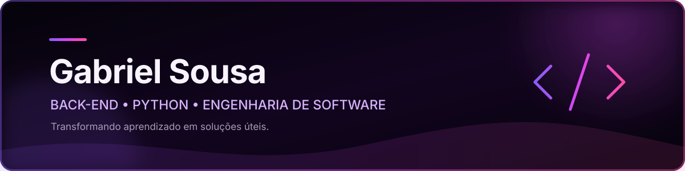

<!-- GitHub Profile README — Gabriel Sousa -->

  

  

  
  
  
  

## Sobre mim

Sou **técnico em Desenvolvimento de Sistemas** e estudante de **Engenharia de Software**, construindo minha trajetória com foco em desenvolvimento **Back-end**.

Tenho afinidade com **Python** e seu ecossistema web, especialmente **Django, Flask e FastAPI**, além de bancos de dados e construção de APIs. Também exploro análise de dados e ferramentas que ajudam a transformar problemas em soluções claras, funcionais e bem estruturadas.

Busco evoluir como desenvolvedor, fortalecer fundamentos de engenharia de software e aplicar o que aprendo em projetos práticos.

## Tecnologias

  

| Foco principal | Conhecimentos complementares |
|:--:|:--:|
| Python · Django · Flask · FastAPI · APIs | JavaScript · HTML5 · CSS3 · Análise de dados |
| PostgreSQL · Supabase | Docker · Git · GitHub · VS Code |

## No que estou focado

- Aprofundar Python e desenvolvimento de APIs.
- Evoluir com Django, Flask e FastAPI.
- Praticar modelagem de dados com PostgreSQL e Supabase.
- Fortalecer fundamentos de Engenharia de Software.
- Transformar estudos em projetos úteis e bem documentados.

## GitHub

  
  

  

  
<strong>Ver gráfico de atividade</strong>

   
  

    
  

## Contribuições

<picture>
  <source media="(prefers-color-scheme: dark)" srcset="https://raw.githubusercontent.com/Gab-sousa/Gab-sousa/output/github-contribution-grid-snake-dark.svg" />
  <source media="(prefers-color-scheme: light)" srcset="https://raw.githubusercontent.com/Gab-sousa/Gab-sousa/output/github-contribution-grid-snake.svg" />
  
</picture>

## Contato

  
  

  

  

